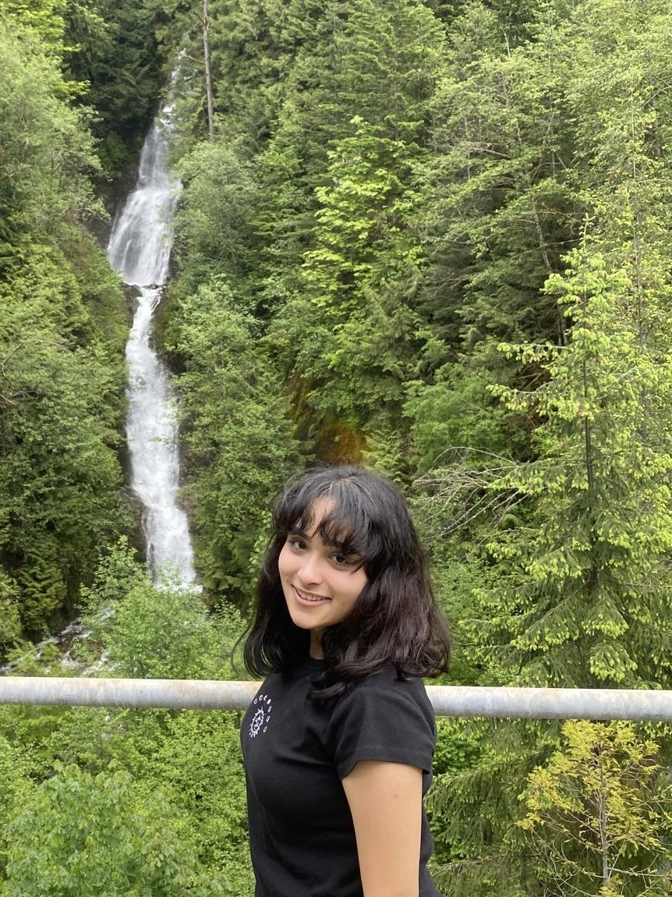

---
layout: single
title: "About Me"
permalink: /about/
author: amulya
author_profile: true
--- 

  

    

      I’m Amulya, and I'm passionate about how large-scale systems, advanced machinery, and automation could transform the way we live. I'm especially drawn to how engineering brings big ideas to life, as working         on conceptual designs that turn into tangible products excites me! 
        
      Working on UBC Rover taught me hands-on about designing and CAD work, and by contributing to a team that focuses on automation and space exploration, which aligns perfectly with my interests, it’s deepened          my passion for creating! While I’m still exploring the industries I may want to specialize in, I’m particularly excited about automation, aerospace, biomanufacturing, consumer electronics and emerging               technologies. My goal is to contribute to projects that push the limits of what’s possible!
        
      If you're interested in talking to me for hours, bring up video games such as <em>Cyberpunk 2077</em>, <em>Final Fantasy VII/XV/XVI</em>, <em>Dragon Age: Inquisition</em>, <em>God of War</em>, or nearly any         RPG/JRPG! I enjoy going on hikes, completing kinetic 3D wooden puzzles, and spending time at the beach with a sci-fi novel in hand. 
    

  

  

    
  

